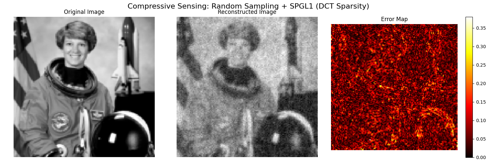

<div align="center">
<h1>Compressive Sensing Image Reconstruction (DCT + SPGL1) 📊🔍</h1>

<a href="README_zh.md">简体中文</a> | ENGLISH

[](https://github.com/AMTOPA/CompressEyeo/releases)
[](https://opensource.org/licenses/MIT)
[](https://www.microsoft.com/windows)
[](https://github.com/AMTOPA/CompressEyeo/graphs/commit-activity)
[](README.md)
[](https://math-enthusiast.top/)

</div>

A demo implementation of **Compressive Sensing (CS)** for image reconstruction using **Discrete Cosine Transform (DCT)** sparsity and **SPGL1** optimization. This project demonstrates how to recover an image from far fewer random measurements than its original size.

> ⚠️ **Note**: This is a **demo version** for educational and research purposes. Not intended for production use.

## ✨ Features

- 🖼️ **Image Preprocessing**: Load and resize standard test image (`skimage.astronaut`)
- 🔀 **DCT Sparsity**: Represent image in DCT domain where it is sparse
- 📏 **Random Gaussian Measurements**: Simulate compressive sensing with `m << n` linear measurements
- 🧮 **SPGL1 Solver**: Use `spgl1` to solve LASSO/BPDN problem in DCT domain
- 📈 **Visualization**: Display original, reconstructed, and error map
- 📊 **Quantitative Metrics**: Compute L2, L∞ error, PSNR, and compression ratio

## 🚀 Quick Start

1. Clone this repository:
   
   ```bash
   git clone https://github.com/your-username/cs-image-dct.git
   cd cs-image-dct
   ```

2. Install dependencies:
   
   ```bash
   pip install numpy matplotlib scikit-image scipy spgl1
   ```

3. Run the script:
   
   ```bash
   python cs_image_dct.py
   ```
   
   🖼️ Results

-----------

Below are the reconstruction results:

### Reconstructed Output

<div align="center"></img></div>

#### Original Image

<div align="center"></img></div>

#### Reconstructed Image

<div align="center"></img></div>

#### Error Map

<div align="center"></img></div>

--------------------------------

> 💡 **Tip**: Increase `m` (number of measurements) for better reconstruction quality.

🧩 How It Works
---------------

1. **Sparsify**: Image is transformed into DCT domain (`s_true = dct2d(image)`)
2. **Measure**: Random Gaussian matrix `A` measures `y = A @ x_true`
3. **Recover**: Solve `min ||s||_1 s.t. ||A @ idct2d(s) - y||_2 ≤ σ` using SPGL1
4. **Reconstruct**: Apply inverse DCT to recovered coefficients

📜 License
----------

This project is licensed under the MIT License - see the [LICENSE](https://chat.qwen.ai/c/LICENSE) file for details.
🤝 Contributing

---------------

Contributions are welcome! Please feel free to submit issues, improvements, or feature requests.

* * *

⭐ If you find this demo helpful, please consider starring the repository!


